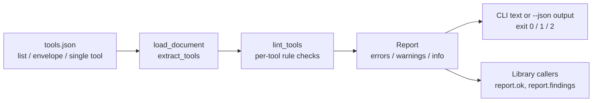

# mcp-tool-lint

Lint **MCP (Model Context Protocol) tool definitions** before your server ships —
catch the naming, description, and `inputSchema` problems that make models
pick the wrong tool, hallucinate arguments, or call destructive tools casually.

Zero dependencies, zero API keys. Runs as a CLI gate in CI or as a library.

## Why

An MCP server is only as good as its tool metadata. The model never sees your
code — it sees names, descriptions, and JSON Schemas. This linter checks the
things that actually break tool use in practice:

| Rule | Severity | What it catches |
|---|---|---|
| `NAME_MISSING` / `NAME_FORMAT` | error | missing name, or characters/length outside the MCP spec (1–64 of `[A-Za-z0-9_-]`) |
| `NAME_DUPLICATE` | error | two tools with the same name |
| `NAME_NOT_SNAKE_CASE` | warning (`--strict`) | inconsistent naming style |
| `DESCRIPTION_MISSING` | error | no description — the model is guessing |
| `DESCRIPTION_TOO_SHORT` | warning | description too thin to choose or parameterise the tool well |
| `SCHEMA_MISSING` / `SCHEMA_TYPE` | error | no `inputSchema`, or its `type` is not `object` |
| `REQUIRED_UNDEFINED` | error | a `required` parameter that is not defined in `properties` |
| `PROPERTY_NO_TYPE` / `PROPERTY_BAD_TYPE` | warning / error | parameter with a missing or unknown JSON Schema type |
| `PROPERTY_NO_DESCRIPTION` | warning | parameter the model must fill in blind |
| `ENUM_EMPTY` | error | an `enum` that allows nothing |
| `DESTRUCTIVE_NO_GUARD` | warning | delete/exec/write-style tool whose description mentions no confirmation, dry-run, or irreversibility |
| `ADDITIONAL_PROPERTIES_UNSET` | info | schema does not say whether stray arguments are rejected |
| `ANNOTATIONS_MISSING` | info | mutating tool without `annotations` hints (`destructiveHint`, `readOnlyHint`) for client UIs |

## Setup

```bash
git clone https://github.com/sulaimanvesal/mcp-tool-lint
cd mcp-tool-lint
python3 -m pytest        # tests (only dev dependency)
```

No install step is required to run it from the repo checkout; you can also
copy the single `mcp_tool_lint/` package into your own project.

## Usage

Export your server's `tools/list` result (or hand-write a tools file — see
`examples/`) and lint it:

```bash
python3 -m mcp_tool_lint examples/good_tools.json   # clean: exit 0
python3 -m mcp_tool_lint examples/bad_tools.json    # errors: exit 1
python3 -m mcp_tool_lint --json tools.json          # machine-readable report
python3 -m mcp_tool_lint --strict tools.json        # warnings fail too; snake_case enforced
```

Exit codes: `0` clean, `1` lint errors (or warnings under `--strict`),
`2` a file could not be loaded.

Accepted input shapes: a bare list of tools, `{"tools": [...]}`, a full
JSON-RPC envelope `{"result": {"tools": [...]}}`, or a single tool object.

As a library:

```python
from mcp_tool_lint import lint_tools, load_document

report = lint_tools(load_document("tools.json"))
if not report.ok:
    print(report.render_text())
```

## Demo

```bash
python3 demo.py
```

Lints both bundled example sets: the good one passes clean and the bad one
shows the errors a CI gate would block on — all offline, no API keys.

## Architecture



Everything lives in `mcp_tool_lint/linter.py` (rules + report) and
`mcp_tool_lint/cli.py` (argument handling, exit codes) — standard library only.

## License

MIT — see `LICENSE`.
